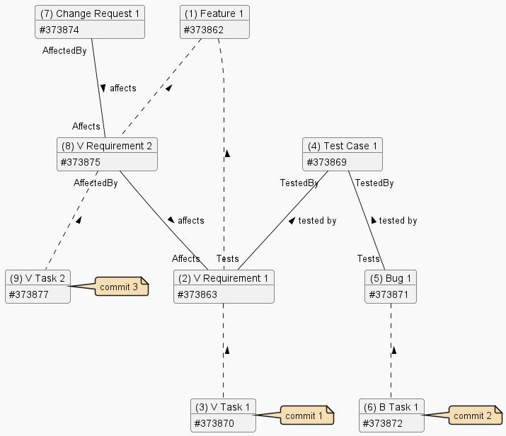

# Feature 1

## Summary

Shows basic Work Items:

- Feature
- Requirement
- Task
- Test Case
- Bug
- Change Request

and their relationships:

- Affects / Affected By
- Tests / Tested By

---

## Diagram

---

## Notes

[General](./readme.md#notes).

---

## Examples

### Commit 1

Commit 1 demonstrates the impact of the Tests / TestedBy relationship.

If Commit 1 occurs at time (3), Release Notes data will contain:

| ID | Type | Reasons | Relationships |
|-|-|-|-|
| 373870 | Task        | PullRequest         | Child (#373863) |
| 373863 | Requirement | PullRequest, Parent | Parent (#373870), Child (#373862) |
| 373862 | Feature     | PullRequest, Parent | Parent (#373863) |

If Commit 1 occurs at time (4) or later. Demonstrates the impact of the Tests / TestedBy relationship. Release Notes data will contain:

| ID | Type | Reasons | Relationships |
|-|-|-|-|
| 373870 | Task        | PullRequest         | Child (#373863) |
| 373863 | Requirement | PullRequest, Parent | Parent (#373870), Child (#373862), TestedBy (#373869) |
| 373862 | Feature     | PullRequest, Parent | Parent (#373863) |
| 373869 | Test Case   | PullRequest, Tests  | Tests (#373863) |

### Commit 2

Commit 2 demonstrates the impact of the Tests / TestedBy relationship.

| ID | Type | Reasons | Relationships |
|-|-|-|-|
| 373872     | Task         | PullRequest         | Child (#373871) |
| 373871     | Bug          | PullRequest, Parent | Parent (#373872), TestedBy (#373869) |
| 373869     | Test Case    | PullRequest, Tests  | Tests (#373871) |

### Commit 3

Example with both Tests / TestedBy and Affects / AffectedBy relationships.

| ID | Type | Reasons | Relationships |
|-|-|-|-|
| 373877     | Task         | PullRequest             | Child (#373875) |
| 373875     | Requirement  | PullRequest, Parent     | Parent (#373877), Child (#373862), Affects (#373863) |
| 373862     | Feature      | PullRequest, Parent     | Parent (#373875) |
| 373863     | Requirement  | PullRequest, AffectedBy | AffectedBy (#373875), TestedBy (#373869), Child (#373862) |
| 373869     | Test Case    | PullRequest, Tests      | Tests (#373863) |
