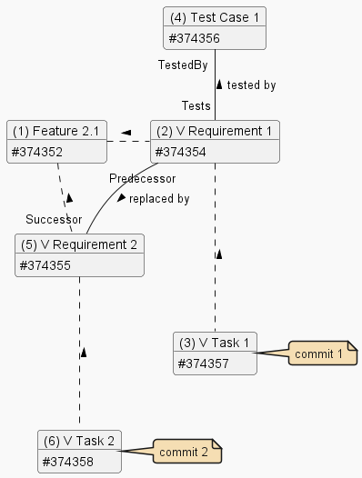

# Feature 2 Variant 1

## Summary

Shows basic Work Items:

- Feature
- Requirement
- Task
- Test Case

and their relationships:

- Predecessor / Successor
- Tests / Tested By

Incorrect variant - with "forgotten" Test Case that remains linked to the Predecessor.

---

## Diagram

---

## Notes

[General](./readme.md#notes).

---

## Examples

### Commit 1

Commit 1 demonstrates the impact of the Predecessor /replaced by/ Successor relationship.
When a commit is created on the "old" Requirement 1 (#374354), the "new" Requirement 2 (#374355) will also be included in Release Notes, because there's a high probability that it affects it too.

| ID | Type | Reasons | Relationships |
|-|-|-|-|
| 374357 | Task        | PullRequest                      | Child (#374354) |
| 374354 | Requirement | PullRequest, Parent, Predecessor | Parent (#374357), TestedBy (#374356), Predecessor (#374355), Child (#374352) |
| 374356 | Test Case   | PullRequest, Tests               | Tests (#374354) |
| 374355 | Requirement | PullRequest, Successor           | Successor (#374354), Child (#374352) |
| 374352 | Feature     | PullRequest, Parent              | Parent (#374354) |

### Commit 2

Commit 2 demonstrates the impact of the Predecessor /replaced by/ Successor relationship.
Test Case 1 (#374356) will not be in Release Notes, because it tests functionality defined by the already obsolete Requirement 1 (#374357).
If this is an error - Test Case 1 was forgotten on Requirement 1 when creating Requirement 2 (#374355) - it needs to be fixed by re-linking to Requirement 2.

| ID | Type | Reasons | Relationships |
|-|-|-|-|
| 374358 | Task        | PullRequest         | Child (#374355) |
| 374355 | Requirement | PullRequest, Parent | Parent (#374358), Child (#374352) |
| 374352 | Feature     | PullRequest, Parent | Parent (#374355) |
