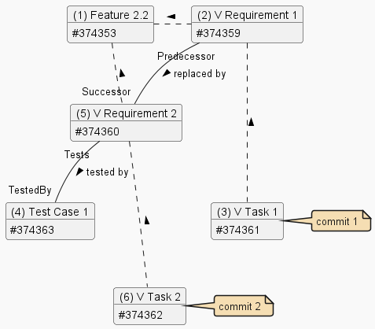

# Feature 2 Variant 2

## Summary

Shows basic Work Items:

- Feature
- Requirement
- Task
- Test Case

and their relationships:

- Predecessor / Successor
- Tests / Tested By

"Correct" variant - with Test Case re-linked to the Successor.

---

## Diagram

---

## Notes

[General](./readme.md#notes).

---

## Examples

### Commit 1

Commit 1 demonstrates the impact of the Predecessor /replaced by/ Successor relationship.
When a commit is created on the "old" Requirement 1 (#374354), the "new" Requirement 2 (#374355) will also be included in Release Notes, because there's a high probability that it affects it too.

| ID | Type | Reasons | Relationships |
|-|-|-|-|
| 374361 | Task        | PullRequest            | Child (#374359) |
| 374359 | Requirement | PullRequest, Parent    | Parent (#374361), Predecessor (#374360), Child (#374353) |
| 374360 | Requirement | PullRequest, Successor | Successor (#374359), Child (#374353), Tested By (#374363) |
| 374353 | Feature     | PullRequest, Parent    | Parent (#374359) |
| 374363 | Test Case   | PullRequest, Tests     | Tests (#374360) |

### Commit 2

Commit 2 demonstrates the impact of the Predecessor /replaced by/ Successor relationship.
Requirement 1 (#374357) will not be in Release Notes, because it is already obsolete.

| ID | Type | Reasons | Relationships |
|-|-|-|-|
| 374362 | Task        | PullRequest         | Child (#374360) |
| 374360 | Requirement | PullRequest, Parent | Parent (#374362), Child (#374353), Tested By (#374363) |
| 374353 | Feature     | PullRequest, Parent | Parent (#374360) |
| 374363 | Test Case   | PullRequest, Tests  | Tests (#374360) |
