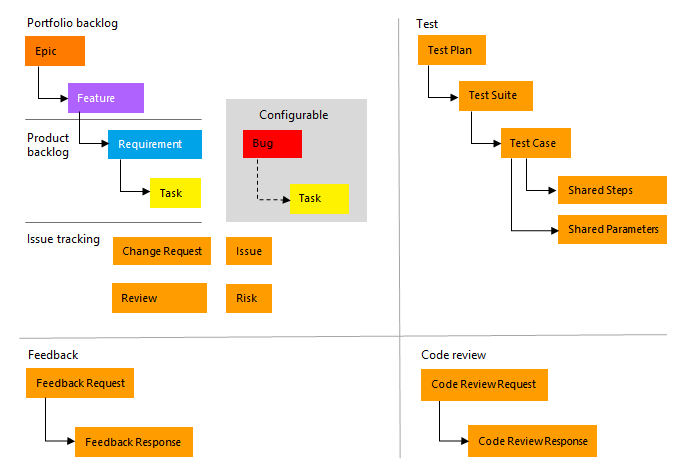
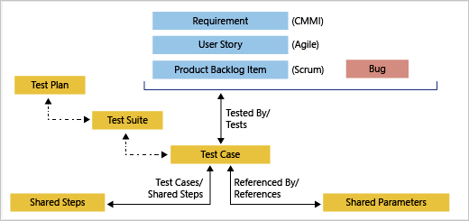
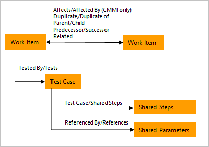

# Azure DevOps Server Work Methodology

## Required Reading

[CMMI Process Template Description](https://learn.microsoft.com/en-us/azure/devops/boards/work-items/guidance/cmmi-process?view=azure-devops)

## Recap

### Parent-Child Relationships (CMMI)

(source: [Understand CMMI process template artifacts](https://learn.microsoft.com/en-us/azure/devops/boards/work-items/guidance/cmmi-process?view=azure-devops))

### TestedBy-Tests Relationships

(source: [Default processes and process templates](https://learn.microsoft.com/en-us/azure/devops/boards/work-items/guidance/choose-process?view=azure-devops))

### Other Relationships

(source: [Default processes and process templates](https://learn.microsoft.com/en-us/azure/devops/boards/work-items/guidance/choose-process?view=azure-devops))

## Examples

More on how to manage work items and their relationships in Azure DevOps can be found in the [readme file](readme.md).
